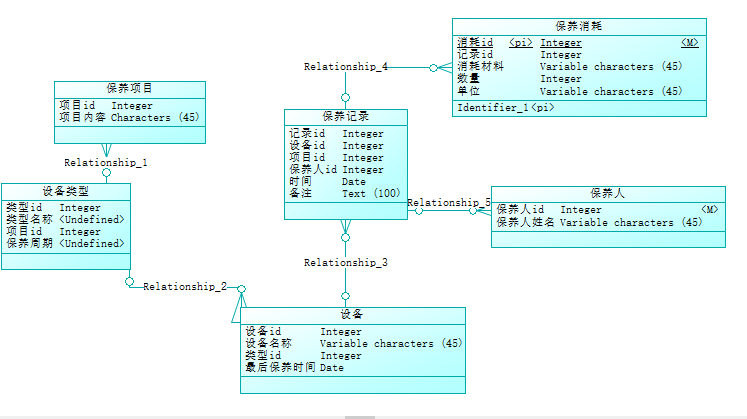
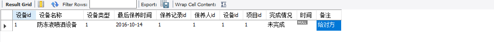
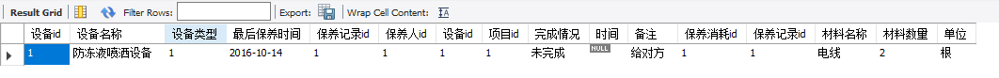

# 电子设备保养系统
##一·ER模型图

##二数据库sql脚本
DROP TABLE IF EXISTS `保养记录`;
CREATE TABLE `保养记录` (
  `保养记录id` int(11) NOT NULL,
  `保养人id` int(11) DEFAULT NULL,
  `设备id` int(11) DEFAULT NULL,
  `项目id` int(11) DEFAULT NULL,
  `完成情况` tinytext,
  `时间` date DEFAULT NULL,
  `备注` text,
  PRIMARY KEY (`保养记录id`),
  KEY `设备_idx` (`设备id`),
  KEY `项目_idx` (`项目id`),
  KEY `保养_idx` (`保养人id`),
  CONSTRAINT `保养` FOREIGN KEY (`保养人id`) REFERENCES `保养人` (`保养人id`) ON DELETE NO ACTION ON UPDATE NO ACTION,
  CONSTRAINT `设备` FOREIGN KEY (`设备id`) REFERENCES `设备表` (`设备id`) ON DELETE NO ACTION ON UPDATE NO ACTION,
  CONSTRAINT `项目` FOREIGN KEY (`项目id`) REFERENCES `保养项目` (`项目id`) ON DELETE NO ACTION ON UPDATE NO ACTION
) ENGINE=InnoDB DEFAULT CHARSET=utf8;
LOCK TABLES `保养记录` WRITE;
INSERT INTO `保养记录` VALUES (1,1,1,1,'未完成',NULL,'给对方');
UNLOCK TABLES;

DROP TABLE IF EXISTS `保养项目`;
CREATE TABLE `保养项目` (
  `项目id` int(11) NOT NULL,
  `项目内容` varchar(45) DEFAULT NULL,
  `设备id` int(11) DEFAULT NULL,
  PRIMARY KEY (`项目id`)
) ENGINE=InnoDB DEFAULT CHARSET=utf8;
LOCK TABLES `保养项目` WRITE;
/*!40000 ALTER TABLE `保养项目` DISABLE KEYS */;
INSERT INTO `保养项目` VALUES (1,'防腐检',1);
/*!40000 ALTER TABLE `保养项目` ENABLE KEYS */;
UNLOCK TABLES;

DROP TABLE IF EXISTS `设备类型`;
CREATE TABLE `设备类型` (
  `设备类型id` int(11) NOT NULL,
  `设备类别名称` varchar(255) DEFAULT NULL,
  `项目id` int(11) DEFAULT NULL,
  `保养周期` int(11) DEFAULT NULL,
  PRIMARY KEY (`设备类型id`),
  KEY `项目_idx` (`项目id`),
  CONSTRAINT `项目id` FOREIGN KEY (`项目id`) REFERENCES `保养项目` (`项目id`) ON DELETE NO ACTION ON UPDATE NO ACTION
) ENGINE=InnoDB DEFAULT CHARSET=utf8;
LOCK TABLES `设备类型` WRITE;
/*!40000 ALTER TABLE `设备类型` DISABLE KEYS */;
INSERT INTO `设备类型` VALUES (1,'6000V以下带振动电机',1,3);
/*!40000 ALTER TABLE `设备类型` ENABLE KEYS */;
UNLOCK TABLES;

CREATE TABLE `设备表` (
    `设备ID` int(11) NOT NULL,
    `设备类型ID` int(11) NOT NULL,
    `最后一次保养时间` date NOT NULL,
    PRIMARY KEY (`设备ID`),
    KEY `k1_idx` (`设备类型ID`),
    CONSTRAINT `k1` FOREIGN KEY (`设备类型ID`) REFERENCES `设备类型` (`设备类型ID`) ON DELETE CASCADE ON UPDATE CASCADE

 CREATE TABLE `保养消耗` (
    `保养消耗ID` int(11) NOT NULL,
    `保养记录ID` int(11) NOT NULL,
    `消耗材料名称` varchar(45) NOT NULL,
    `数量` int(11) NOT NULL,
    `单位` varchar(45) NOT NULL,
    PRIMARY KEY (`保养消耗ID`),
    KEY `k5_idx` (`保养记录ID`),
    CONSTRAINT `k5` FOREIGN KEY (`保养记录ID`) REFERENCES `保养记录` (`保养记录ID`) ON DELETE CASCADE ON UPDATE CASCADE；
  INSERT INTO `保养xiaohao` VALUES (1,1,'电线',2,'根');

DROP TABLE IF EXISTS `保养人`;
/*!40101 SET @saved_cs_client     = @@character_set_client */;
/*!40101 SET character_set_client = utf8 */;
CREATE TABLE `保养人` (
  `保养人id` int(11) NOT NULL,
  `保养人姓名` varchar(10) NOT NULL,
) ENGINE=InnoDB DEFAULT CHARSET=utf8;

##三数据库查询
###（1）根据设备id查询保养记录
select * from 设备表 as a inner join 保养记录 as b on a.设备id=b.设备id where a.设备id="1"

###（2）根据设备id打印检修报告
select * from 设备表 as a inner join 保养记录 as b on a.设备id=b.设备id left join 保养消耗 as c on b.保养记录id=c.保养记录id where a.设备id="1" 

##四 原型设计
[axure原型设计](http://7kjelj.axshare.com)
